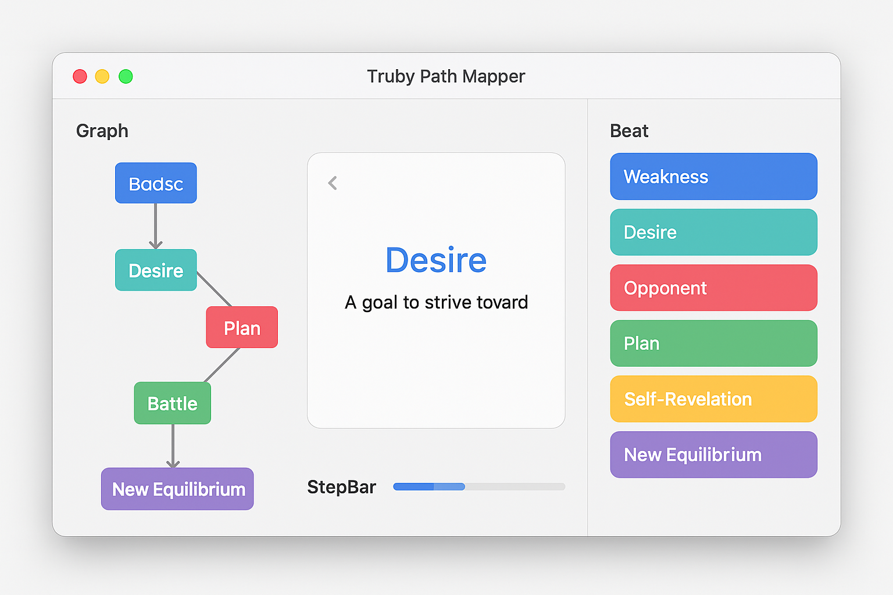
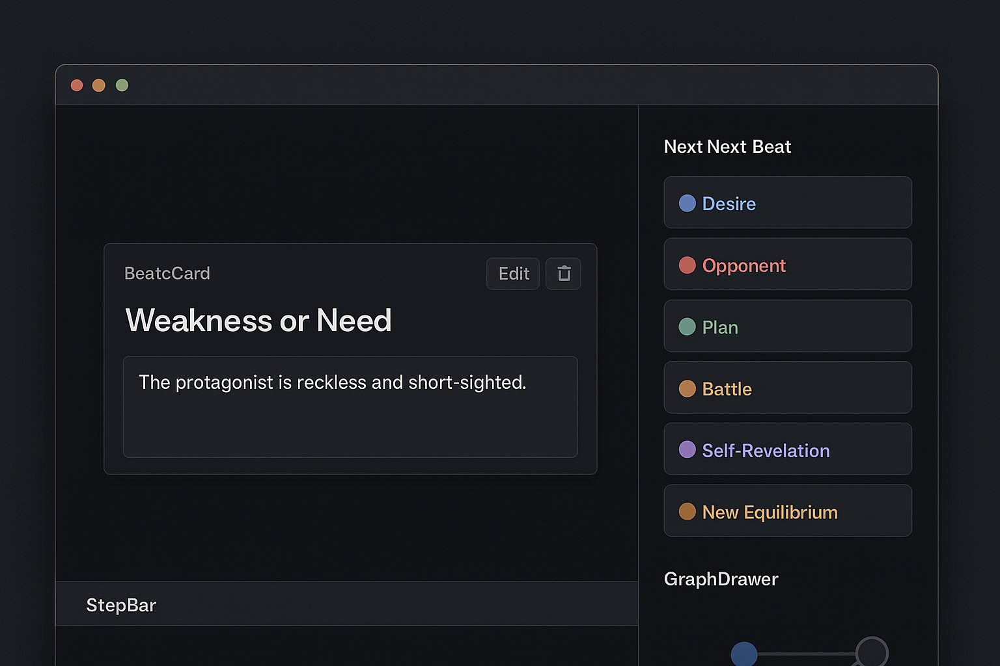

# Truby Path Mapper

> **Where structure meets possibility.** Traverse John Truby’s story lattice in realtime—branch, break, and rebuild your plot until it *sings*.


---

## Ignition | Why this Exists

Writing feels like spelunking with one match: the moment the flame goes out, you bump a wall.  Beat spreadsheets offer light, but only in a straight tunnel.  Truby Path Mapper hands you a **holographic map**—every corridor, every locked door, every false floor—so you can race the maze instead of measuring it.

*What if the fake‑ally strikes sooner?* Click and see the ripple.  *What if revelation #3 never lands?* Erase it and watch tension collapse.  Risk‑free experimentation, structural integrity intact.

This project is for anyone who hears story logic **humming under the hood** and wants a dashboard, not a sticky note.

---

## One‑Minute Tour

| Light UI                                | Dark UI                               |
|-----------------------------------------|---------------------------------------|
|  |  |

BeatCard → jot ideas · Palette → choose next beat · StepBar → pulse of progress · GraphDrawer → full skeleton · ⌘K palette → power moves

---

## Feature Sparks

* **Graph‑True Engine** – Finite‑state rules keep you legal while you go feral.
* **Loop + Rewind** – Fork timelines, watch theme mutate, zip back if it dies.
* **Colour‑Coded Step Pulse** – Seven hues, instant moral readout.
* **JSON & Beyond** – Export notes; pipe into Scrivener, Notion, or your AI co‑pilot.
* **Keyboard Sovereignty** – Build entire acts without touching the mouse.

---

## Boot‑Up

```bash
pnpm i && pnpm dev   # http://localhost:5173
```

Run `pnpm build` to mint a static bundle; drop into any CDN.

---

## Under the Hood

```
XState  → beat legality
Cytoscape → graph render
Zustand → prefs + persistence
Tailwind → design system
Vite/React/TS → core stack
```

---

## Road Ahead

- Branch diff viewer (A/B outline compare)
- Weight‑based AI beat suggestions
- Multi‑protagonist overlay
- PDF beat sheet export

Track progress in [`projects/1`](https://github.com/jonathan‑craig/truby-path-mapper/projects/1).

---

## Contribute with Fire

1. Fork, create a feature branch.
2. `pnpm lint typecheck test`—green or it doesn’t ship.
3. PR title like a killer logline.


MIT License | 2025 Jonathan Craig

